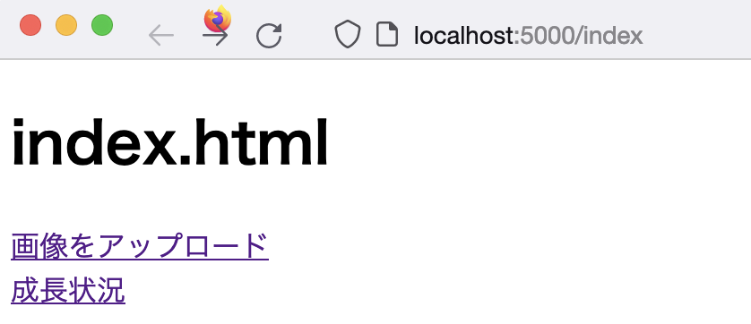
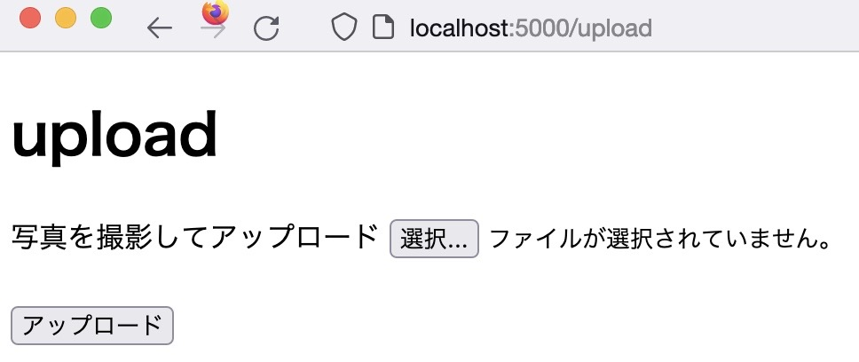
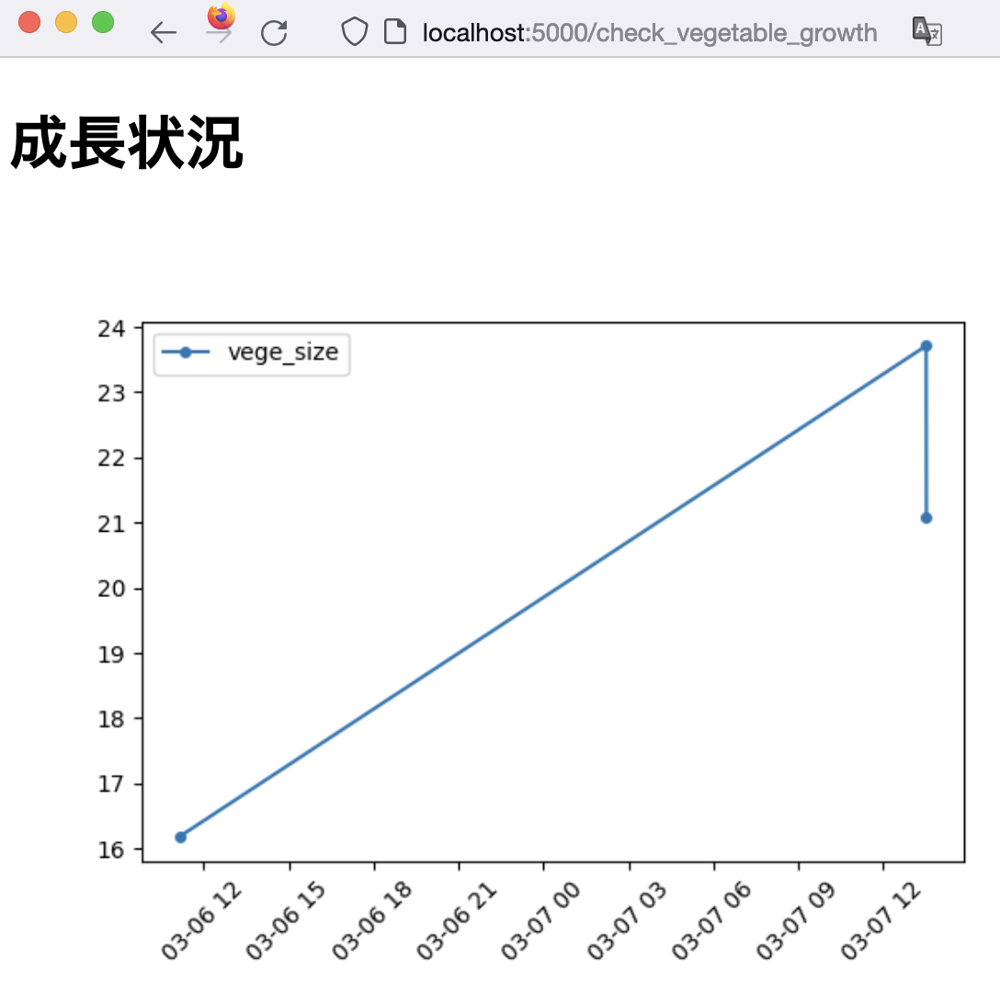
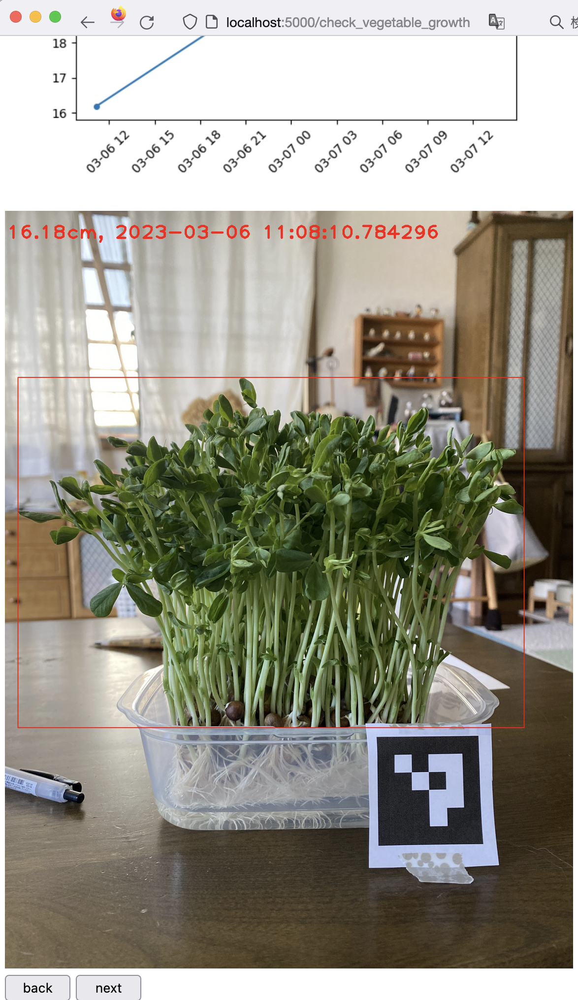

# vegetable_size_project

## 概要

野菜の近くにArUcoマーカを印刷して配置する。
ArUcoと野菜を、同じ画像に映るように撮影する。
撮影した画像をアップロードする

アップロードした画像は、成長状況から確認できる。
確認できるもの
1. 野菜の大きさをグラフに描画したもの。
2. アップロードした画像に、検出結果とアップロード日時を付与した画像

## プレビュー






## 環境構築

venvで仮想環境を構築
``` bash
python -m venv .env
```
b
venv 仮想環境内で必要なライブラリのインストール
``` bash
pip install -r requirement.txt
```

ルートディレクトリで
``` bash
python server.py
```

立ち上げたサーバーにアクセスする
http://localhost:5000/index
